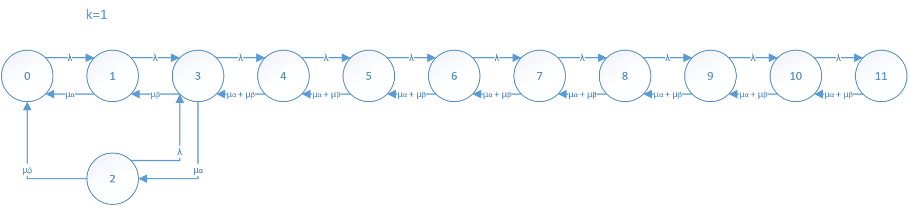
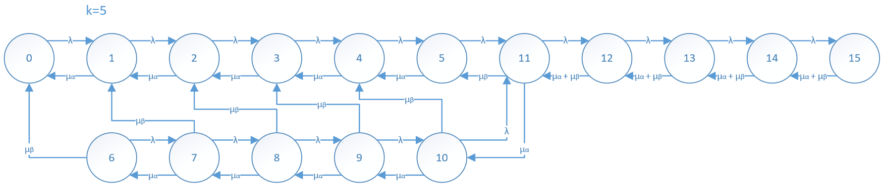
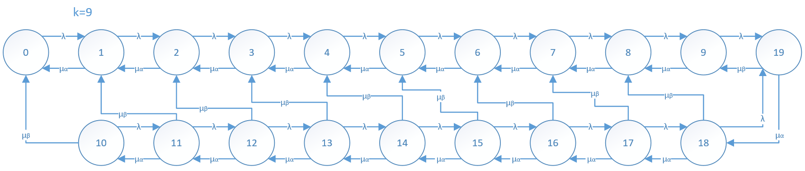

## Simulation exercise

In this exercise, we simulate a queuing system M/M/2/10 with threshold k, and examine the effect of the arrival rate λ (1, 2, 3) and threshold k (1...9).

Sample state diagrams:
- k = 1

- k=5

- k=9

